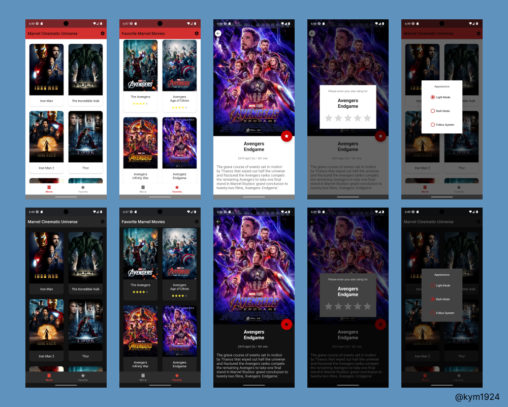
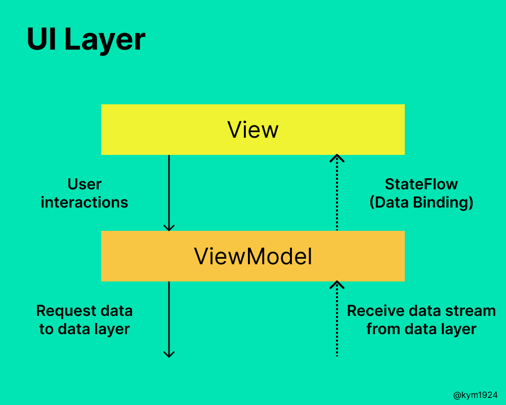
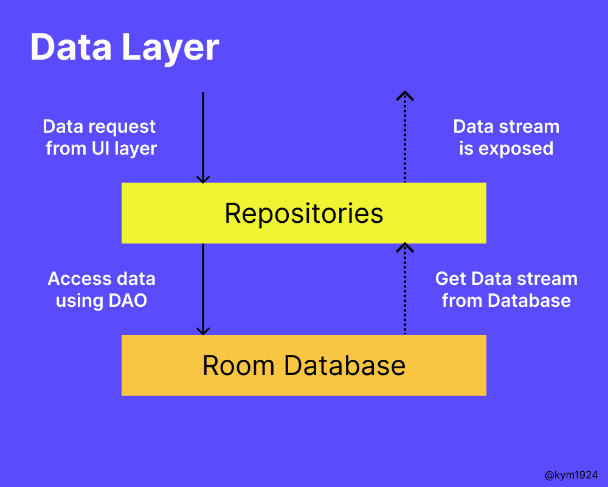
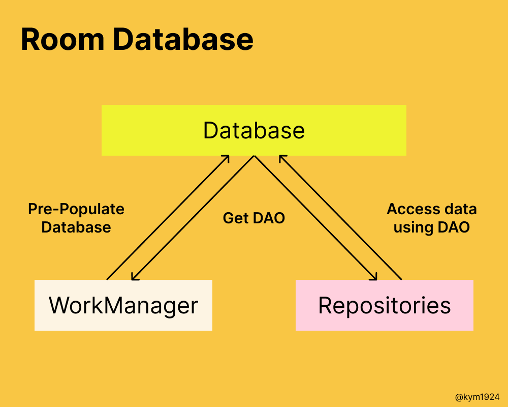

<div>


</div>

# Marvel Cinematic Universe
Marvel Cinematic Universe is an app for practicing various [Jetpack libraries](https://developer.android.com/jetpack).
<br>
<br>


<br>

## Used Library
- **[Kotlin](https://kotlinlang.org/)**
  - [Coroutines](https://kotlinlang.org/docs/coroutines-guide.html)
  - [Flow](https://kotlinlang.org/docs/flow.html)
- **Android**
  - [AppStartup](https://developer.android.com/topic/libraries/app-startup) : A straightforward, performant way to initialize components at application startup.
  - [DataBinding](https://developer.android.com/topic/libraries/data-binding) : Bind UI components in your layouts to data sources in your app using a declarative format.
  - [Hilt](https://developer.android.com/training/dependency-injection/hilt-android) : Jetpack's recommended DI solution for Android.
  - [JankStats](https://developer.android.com/topic/performance/jankstats) : Track and analyze jank performance problems in your app's UI.
  - [Lifecycle](https://developer.android.com/reference/androidx/lifecycle/Lifecycle) : Defines an object that has an Android Lifecycle.
  - [Navigation-component](https://developer.android.com/guide/navigation) : Framework for navigating between destinations within an app.
  - [Room](https://developer.android.com/training/data-storage/room) : Database persistence layer designed for usability, safety, and testability.
  - [Splash-screens](https://developer.android.com/develop/ui/views/launch/splash-screen) : A new app launch animation for all apps when running on a device with Android 12 or higher.
  - [ViewModel](https://developer.android.com/topic/libraries/architecture/viewmodel) : A business logic or screen level state holder.
  - [WorkManager](https://developer.android.com/reference/androidx/work/WorkManager) : A library for managing deferrable and guaranteed background work.
- **Architecture**
  - MVVM (Model - View - ViewModel)
  - Repository Pattern
- [Glide](https://github.com/bumptech/glide) : An image loading and caching library for Android.
- [Gson](https://github.com/google/gson) : A Java serialization/deserialization library to convert Java Objects into JSON and back.
- [Material-Components](https://github.com/material-components/material-components-android) : Modular and customizable Material Design UI components for Android.
- [Timber](https://github.com/JakeWharton/timber) : A logger with a small, extensible API.

## Used Content
- All content used in [this json file](https://github.com/kym1924/marvel/blob/master/app/src/main/assets/marvel.json) was taken from [Marvel Official site](https://www.marvel.com/).

## Architecture
- Trying to follow [Guide to app architecture.](https://developer.android.com/topic/architecture)
- This application is based on MVVM architecture and Repository pattern.


- This application consists of two layers.
  - [UI Layer](https://developer.android.com/topic/architecture#ui-layer) : display the data on the screen.
  - [Data Layer](https://developer.android.com/topic/architecture#data-layer) : contains the business logic.
- [Unidirectional Data Flow(UDF)](https://developer.android.com/topic/architecture#unidirectional-data-flow)
  - In UDF, data flows in only one direction.
  - The events that modify the data in the opposite direction.

### UI Layer

- UI Layer consists of two things.
  - View(UI elements) that renders data to the screen.
  - [ViewModel](https://developer.android.com/topic/libraries/architecture/viewmodel) that holds data, exposes data, handles logic.
- ViewModel exposes the data, and the View observes the data.
  - This interaction is simplified by [Data Binding Library](https://developer.android.com/topic/libraries/data-binding).

### Data Layer

- Data layer contains Repositories where [DAO](https://developer.android.com/training/data-storage/room/accessing-data) is injected to access Database.
- Repositories get immutable data stream from Database and expose it to the ViewModel.

### Room Database


- To use the Room database efficiently, refer to [the 7-pro-tips.](https://medium.com/androiddevelopers/7-pro-tips-for-room-fbadea4bfbd1)
- **Pre-populate your database via RoomDatabase#Callback.**
  - You can detect the moment the database is created with RoomDatabase.Callback().
  - Using [WorkManager](https://github.com/kym1924/marvel/blob/master/app/src/main/java/com/kimym/marvel/worker/MarvelDatabaseWorker.kt), add default data when a database is created.
  - You can [build an offline-first app](https://developer.android.com/topic/architecture/data-layer/offline-first) by adding default data.
  - That is, it can perform some or all of its business logic without access to the internet.
  
  ```kotlin
  Room.databaseBuilder(
      context,
      MarvelDatabase::class.java,
      "Marvel.db"
  ).addCallback(
      object : RoomDatabase.Callback() {
          override fun onCreate(db: SupportSQLiteDatabase) {
              super.onCreate(db)
              val request = OneTimeWorkRequestBuilder<MarvelDatabaseWorker>().build()
              WorkManager.getInstance(context).enqueue(request)
          }
      }
  ).build()
  ```

- **Read only what you need.**
  - For example, Movie data class stored in the database has 7 fields.
  
  ```kotlin
  @Entity
  data class Movie(
      @PrimaryKey val id: Int,
      val title: String,
      val phase: Int,
      val content: String,
      val release: String,
      @ColumnInfo(name = "running_time") val runningTime: Int,
      val image: String
  )

  // In DAO
  @Query("SELECT * FROM Movie")
  fun getMovies(): Flow<List<Movie>>
  ```
  
  - Instead of getting all field values stored in the database, read only what you need.
  
  ```kotlin
  data class MovieBasicInfo(
      val id: Int,
      val title: String,
      val image: String
  )

  // In DAO
  @Query("SELECT id, title, image FROM Movie")
  fun getMovies(): Flow<List<MovieBasicInfo>>
  ```
  
  - This will also improve the speed of queries by reducing the IO cost.
